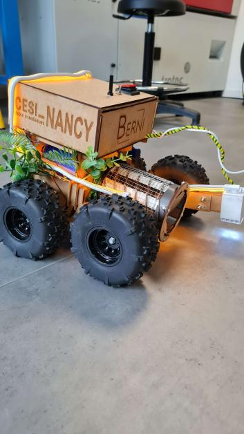
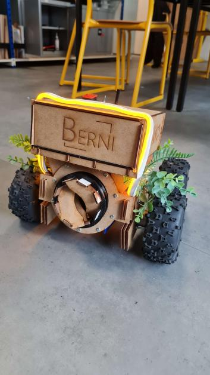
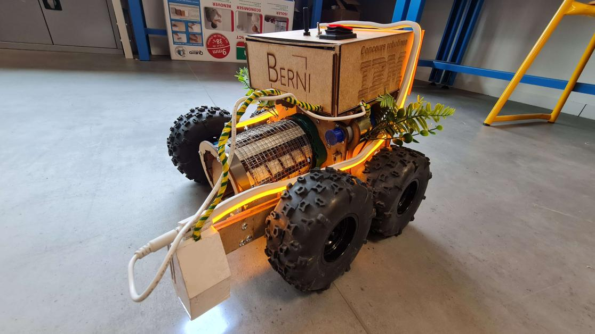

# Berni

Berni, le robot créé par le centre CESI de Nancy, a participé avec succès au Concours Robotique de Pornichet organisé par IBM. Grâce à ses fonctionnalités innovantes et son objectif de dépollution des plages en ramassant les mégots de cigarette, Berni a su se démarquer lors de la compétition. En se classant à la 3e place, le centre CESI de Nancy a fièrement représenté ses étudiants et démontré l'efficacité de son projet dans la préservation de l'environnement. Berni a suscité l'attention et l'intérêt du jury professionnel, des experts et du public, renforçant ainsi l'idée d'une utilisation responsable des technologies robotiques pour la protection des plages et des océans. Cette performance souligne l'engagement du centre CESI de Nancy en faveur du développement durable et de la promotion de solutions innovantes pour préserver notre planète.

Liste des participants :
- [Lucas HAUSWIRTH](https://www.linkedin.com/in/lucas-hauswirth-187330235/) - Conception/Modélisation/Construction
- [Antoine FAURE](https://github.com/Arrrlinks) - Code/Electronique
- [Matthis PINHEIRO-CRUZ](https://github.com/Matth2A) - Soudures
- [Gabriel ANCIAUX](https://github.com/Shulkogu) - Fixations
- [Rémi SENECHAL](https://www.linkedin.com/in/r%C3%A9mi-snchl/)
- [Léanne VOLBURGER](https://www.linkedin.com/in/l%C3%A9anne-vorburger/)
- [Nathan LEVAUDEL](https://www.linkedin.com/in/nathan-levaudel-116458256/)
